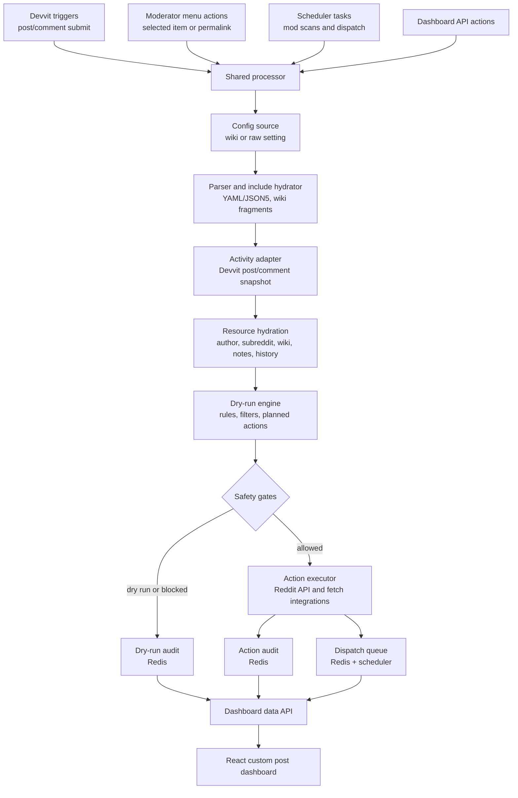
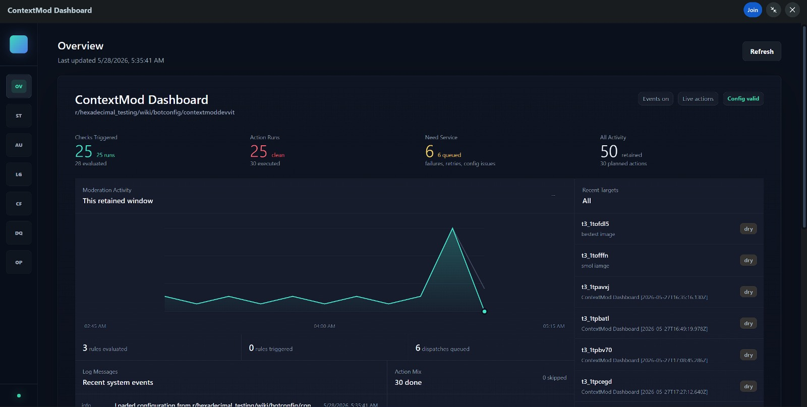
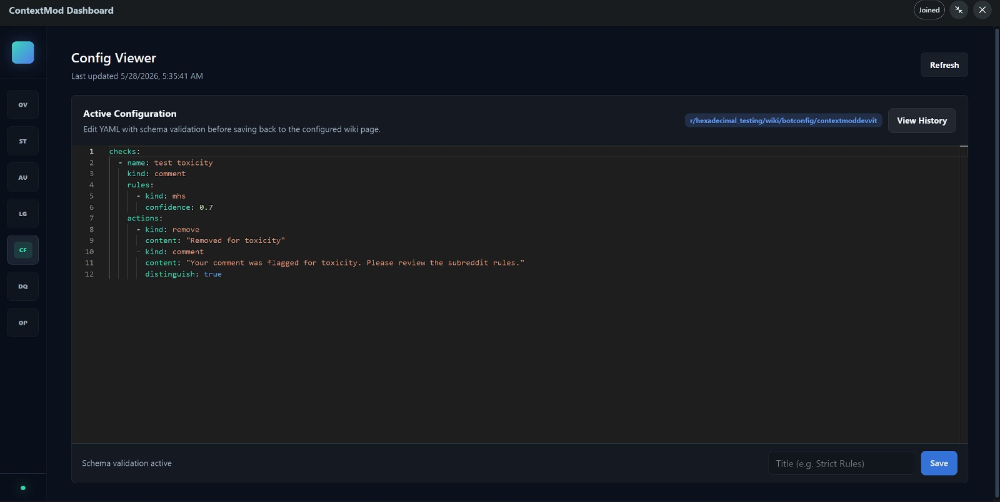
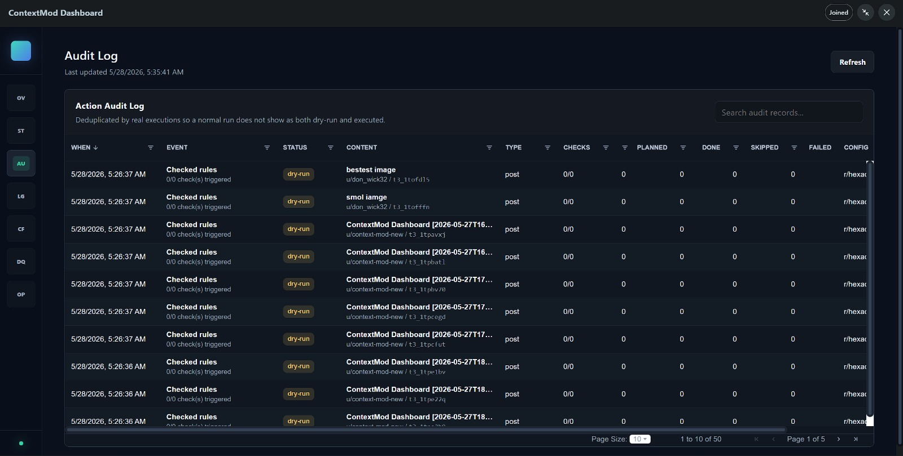
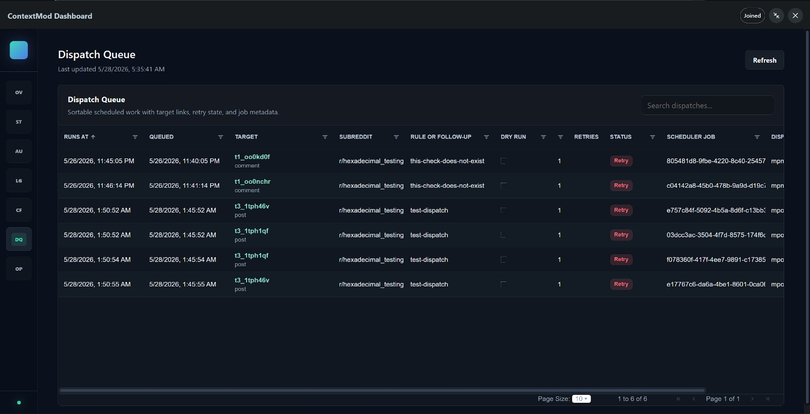

# ContextMod Devvit Port

[](https://www.youtube.com/watch?v=onKKjmyEsHo)

ContextMod Devvit is the Reddit Devvit migration of the legacy
[`old/context-mod`](../../old/context-mod) moderation bot.

It keeps the old ContextMod YAML/JSON5 configuration model and core moderation
behavior, but replaces the externally hosted Node/Express service, polling
daemon, SQL database, InfluxDB, Grafana, and OAuth helper with Devvit-native
triggers, menus, scheduler tasks, settings, Redis, and a custom post dashboard.

| Area | Current state |
| --- | --- |
| Migration milestone | Devvit-only migration complete |
| Runtime | Devvit hosted app with Hono routes through `@devvit/web` |
| Default safety | Event processing off, action execution dry-run on |
| Storage | Bounded Devvit Redis records for config history, audits, queues, and caches |
| Dashboard | Devvit custom post webview backed by `/api/dashboard` |

> **Migration note**
>
> The Devvit port is not a clone of the old hosting and observability stack.
> SQL audit history, InfluxDB, Grafana, Docker hosting, arbitrary URL includes,
> and several legacy network behaviors were deliberately replaced or left out
> because they do not fit the Devvit runtime.

## Table Of Contents

- [What Exists Now](#what-exists-now)
- [Migration Status](#migration-status)
- [New vs Old](#new-vs-old)
- [Architecture](#architecture)
- [Dashboard And UI](#dashboard-and-ui)
- [Commands](#commands)
- [Playtest Flow](#playtest-flow)
- [Legacy Compatibility Notes](#legacy-compatibility-notes)
- [Fetch Domains](#fetch-domains)
- [Future Improvements](#future-improvements)

## What Exists Now

### Moderator Workflow

- Validate legacy ContextMod YAML or JSON5 from a subreddit menu action.
- Load configuration from `r/<subreddit>/wiki/botconfig/contextbot`.
- Override config from a Devvit subreddit setting for playtests.
- Run checks manually on selected posts and comments.
- Run checks by pasted permalink, `t1_` comment ID, or `t3_` post ID.
- Scan modqueue and unmoderated queues on demand or by scheduled task.
- Open a native Devvit dashboard custom post.
- Create built-in comment and submission fixtures for migration smoke tests.
- See recent dry-run, real-action, dispatch, config, and status data from Redis.

### Config Support

- YAML and JSON5 parsing.
- Structural validation with migration warnings.
- Runs, checks, named rules, named actions, rule sets, author filters, and item
  filters.
- Filter defaults with merge and replace behavior.
- Flow control with `next`, `stop`, `nextRun`, and `goto`.
- Same-subreddit wiki fragments.
- Cross-subreddit wiki fragments when the installed app can read the wiki.
- Wiki-backed action template content.
- Legacy-style action placeholders such as `{{item.*}}`,
  `{{item.author.age}}`, `{{rules.<name>.<field>}}`, and
  `{{action.0.status}}`.

### Event Ingestion

- `onPostSubmit` maps the old `newSub` polling source to Devvit post triggers.
- `onCommentSubmit` maps the old `newComm` polling source to Devvit comment
  triggers.
- Scheduled moderation scans cover bounded `modqueue` and `unmoderated` runs.
- Manual menu runs use the same processor as triggers and scheduled tasks.
- Dispatch jobs rehydrate targets later with `dispatch:*` source metadata.

### Rules

The Devvit port recognizes and evaluates all legacy rule kinds in the supported
migration surface:

| Rule kind | Devvit support |
| --- | --- |
| `author` | Ported with author metadata hydration and filters |
| `regex` | Ported for current activity, history windows, and wiki-backed tokens |
| `history` | Ported for bounded author history counts and percentages |
| `recentActivity` | Ported for bounded history, subreddit criteria, and Reddit image matches |
| `repeatActivity` | Ported for exact and fuzzy repeat detection |
| `attribution` | Ported for domain and self-promotion aggregation |
| `repost` | Ported for hydrated duplicate/crosspost candidates and YouTube checks |
| `sentiment` | Ported with bundled VADER scoring |
| `mhs` | Replaced by Gemini toxicity classification |
| `toxicity` | Ported through Gemini toxicity classification |

### Filters

- Author filters: name, flair text/CSS/template/background, moderator status,
  contributor status, account age, karma, verified email, shadowbanned state,
  profile description, NSFW profile state, Toolbox user notes, and Reddit mod
  notes where Devvit exposes the needed data.
- Item filters: removed, approved, deleted, filtered, locked, spam, stickied,
  distinguished, archived, quarantined, hidden, report state, score, age,
  created-on day, source, dispatch state, subreddit metadata, Reddit media,
  title, link flair, upvote ratio when available, comment OP state, comment
  depth, and parent submission state.
- Subreddit criteria in history paths: name, NSFW, quarantine, type, profile,
  and own-profile checks when present in hydrated snapshots.

### Actions

All supported legacy action families have Devvit execution paths and dry-run
planning:

| Action kind | Devvit support |
| --- | --- |
| `approve` | Self and comment parent targets |
| `remove` | Remove, spam flag, reason ID, and templated removal note |
| `report` | Templated report reason |
| `lock` | Self targets with already-locked skip logic |
| `comment` | Self, parent, permalink, and thing-ID targets with lock/distinguish/sticky |
| `flair` | Post flair assignment |
| `submission` | Same-subreddit self/link post creation with modifiers |
| `userflair` | Assign and remove user flair |
| `ban` | Templated message, reason, note, duration, and footer |
| `message` | Direct messages, moderator messages, and hidden-author modmail where supported |
| `contributor` | Add and remove contributors |
| `modnote` | Reddit mod note creation and duplicate checks |
| `usernote` | Toolbox `usernotes` wiki read/write and duplicate checks |
| `dispatch` | Redis queue plus Devvit scheduler delayed processing |
| `cancelDispatch` | Cancel pending dispatch records and scheduler jobs |

Real actions are blocked unless all safety gates pass:

1. **Enable event processing** is true.
2. **Dry run actions** is false.
3. The action has `enable: true`.
4. The action-level `dryRun` option is not true.
5. The check, filters, and action planning path are supported.

### Dashboard, Audit, And Operations

- React custom post dashboard.
- Monaco YAML editor with ContextMod schema validation.
- AG Grid-backed audit and data tables.
- Overview, status, audit log, logs, config viewer/editor, dispatch queue, and
  operations views.
- `/api/dashboard` endpoint that combines config state, runtime settings,
  retained dry-run records, retained action audit records, dispatch records, and
  config revisions.
- Config save and validation endpoints for wiki-backed configuration.
- Bounded Redis records for dry-runs, real actions, config revisions, report
  history, dispatches, and caches.

## Migration Status

| Migration area | Status |
| --- | --- |
| Foundation and Devvit scaffold | Complete |
| Architecture boundaries | Complete |
| Event ingestion | Complete |
| Config features | Complete |
| Filters | Complete |
| Rules | Complete |
| Actions | Complete |
| Storage and persistence | Complete for bounded Redis milestone |
| Notifications | Complete for Discord plus Devvit-native surfaces |
| Web and moderator UX | Complete for Devvit dashboard milestone |
| Fetch-domain decisions | Complete |
| Test plan | Complete |

The remaining differences are product and platform decisions. They are listed in
[Legacy Compatibility Notes](#legacy-compatibility-notes).

## New vs Old

| Capability | Old `old/context-mod` | New `port/context-mod-devvit` | Migration status |
| --- | --- | --- | --- |
| Runtime model | Externally hosted Node process with long-lived server/client apps | Devvit hosted app, Hono routes, Devvit triggers, menu actions, scheduler tasks | Replaced |
| Reddit API | `snoowrap` and polling helpers | Devvit Reddit API with moderator scope | Migrated with Devvit constraints |
| Event ingestion | `newSub`, `newComm`, `modqueue`, and `unmoderated` polling | Post/comment submit triggers plus bounded scheduled modqueue/unmoderated scans | Migrated |
| Manual runs | Web UI could run bot on a permalink | Menu actions run selected item or pasted permalink/thing ID | Migrated |
| Config source | Subreddit wiki YAML/JSON5 with partial configs | Wiki YAML/JSON5, raw setting override, same/cross-subreddit wiki fragments | Migrated |
| URL config includes | Arbitrary URL-backed fragments | Blocked unless a future exact fetch-domain policy is approved | Not ported |
| Config editing | External web editor with schema validation | Devvit dashboard editor with Monaco YAML/schema validation and wiki save | Rebuilt |
| Rule engine | Author, regex, history, recent activity, repeat, attribution, repost, sentiment, MHS | Same supported kinds, with MHS/toxicity using Gemini and bounded Devvit data | Migrated with behavior changes |
| Author and item filters | Broad metadata through snoowrap and stored history | Devvit snapshots plus hydrated resources and bounded Redis report history | Migrated where Devvit exposes data |
| Image comparison | Fingerprint and pixel comparison, broader fetch ability | Pure JS perceptual hashing for Reddit-hosted `i.redd.it` and `preview.redd.it` images | Partially migrated |
| Repost detection | Reddit, duplicate/crosspost, external services including YouTube | Hydrated duplicate/crosspost candidates and YouTube Data API support | Migrated with bounded search |
| Toxicity/MHS | `moderatehatespeech.com` provider | Gemini API classifier replacement | Replaced |
| Actions | Remove, approve, report, lock, comment, flair, usernote, modnote, ban, message, contributor, dispatch, submission | All supported action kinds have execution and dry-run paths | Migrated |
| `comment.asModTeam` | Public-as-subreddit reply behavior | Not exposed by Devvit in the same way | Not ported |
| Cross-subreddit action targets | Legacy service could target broader contexts depending on credentials | Cross-subreddit moderator action targets are blocked | Not ported |
| Delayed dispatch | Server-managed delayed processing | Redis dispatch queue plus Devvit scheduler jobs | Migrated |
| Persistence | SQL databases plus cache stores | Devvit Redis bounded records and TTL caches | Replaced |
| Historical audit import | SQL audit data persisted externally | Old SQL audit history is not imported into Redis | Not ported |
| Metrics | InfluxDB and Grafana | Dashboard aggregates retained Redis audit data | Replaced |
| Dashboard | External Express UI, OAuth, logs, bot controls, Grafana links | Devvit custom post dashboard with config, audit, dispatch, operations, and status | Rebuilt |
| Start/stop controls | Operator daemon controls | Devvit app settings and trigger gates | Replaced |
| OAuth helper | Operator-hosted OAuth invite flow | Devvit install/settings flow | Not needed |
| Hosting | Docker, Heroku, docker-compose, external secrets | Devvit app upload/playtest/publish | Replaced |
| Notifications | Discord and legacy notification event mapping | Discord webhooks, menu toasts, audit records, logs, and explicit message/modmail actions | Migrated with new surfaces |
| Tests | Mocha/nyc and old fixtures | Vitest, TypeScript checks, ESLint, migration fixtures, Redis abstractions | Rebuilt |

## Architecture

### High-Level Flow



### Source Layout

| Path | Responsibility |
| --- | --- |
| [`devvit.json`](devvit.json) | Devvit menu, form, trigger, scheduler, post, permission, fetch-domain, and setting declarations |
| [`src/index.ts`](src/index.ts) | Hono app composition for `/api` and `/internal` routes |
| [`src/routes/menu.ts`](src/routes/menu.ts) | Moderator menu actions, validation, manual runs, scans, fixtures, dashboard open action |
| [`src/routes/forms.ts`](src/routes/forms.ts) | Devvit form submissions such as permalink/thing-ID runs |
| [`src/routes/triggers.ts`](src/routes/triggers.ts) | App install/upgrade setup plus post/comment submit trigger handling |
| [`src/routes/scheduledTasks.ts`](src/routes/scheduledTasks.ts) | Dispatch processing and recurring moderation queue scans |
| [`src/routes/api.ts`](src/routes/api.ts) | Dashboard, config validation/save, config revision, and dashboard operation APIs |
| [`src/routes/dashboardData.ts`](src/routes/dashboardData.ts) | Aggregates Redis/config/runtime state into dashboard view models |
| [`src/config`](src/config) | Legacy schema types, parser, validator, config source loader, wiki include hydration |
| [`src/runtime`](src/runtime) | Activity snapshots, resources, dry-run engine, rule evaluation, actions, scans, dispatch, notifications |
| [`src/storage`](src/storage) | Redis key design for audit, action audit, dispatch queue, config history, retention, caches |
| [`src/client`](src/client) | React dashboard, Monaco editor, AG Grid tables, and dashboard styling |
| [`public/schema`](public/schema) | ContextMod JSON schemas used by dashboard validation |
| [`scripts/audit-migration-config.mjs`](scripts/audit-migration-config.mjs) | Static migration audit tool for legacy configs |
| [`tests`](tests) | Vitest coverage for parser, rules, resources, actions, dashboard data, queues, scans, and migration fixtures |

### Runtime Entrypoints

| Entrypoint | Route | What it does |
| --- | --- | --- |
| Subreddit menu: status | `/internal/menu/status` | Shows retained dry-run and action audit status |
| Subreddit menu: validate | `/internal/menu/validate-config` | Parses active config and returns warnings/errors |
| Post/comment menu: run check | `/internal/menu/run-context-mod-check` | Runs selected item through the shared processor |
| Subreddit menu: run by permalink | `/internal/menu/run-context-mod-by-permalink` plus form route | Runs a pasted permalink or thing ID |
| Subreddit menu: moderation scan | `/internal/menu/run-moderation-scan` | Scans modqueue and unmoderated listings now |
| Fixture menus | `/internal/menu/test-comment-fixture`, `/internal/menu/test-submission-fixture` | Creates temporary test content and runs dry-run fixtures |
| Dashboard menu | `/internal/menu/open-dashboard` | Opens the custom post dashboard |
| Install/upgrade trigger | `/internal/triggers/on-app-install` | Schedules moderation scans and creates default config wiki page if needed |
| Post submit trigger | `/internal/triggers/on-post-submit` | Processes new posts when enabled |
| Comment submit trigger | `/internal/triggers/on-comment-submit` | Processes new comments when enabled |
| Dispatch scheduler | `/internal/scheduler/context-mod-dispatch` | Processes due dispatch records |
| Moderation scan scheduler | `/internal/scheduler/context-mod-moderation-scan` | Processes bounded queue scans and reschedules itself |
| Dashboard API | `/api/dashboard` | Returns dashboard state |
| Config APIs | `/api/config`, `/api/config/validate`, `/api/config/revision/:id` | Validates, saves, reads, and deletes config revisions |

### Data Model

Devvit Redis is used as bounded operational storage:

- Config revision history for dashboard edits.
- Dry-run audit records.
- Real action audit records.
- Dispatch queue records, target indexes, scheduler job IDs, retries, and
  dead-letter state.
- Namespaced TTL caches for wiki/config/resource hydration.
- Report history observed by the app for report time-window filters.
- Retention cleanup for records that should not grow without bound.

Redis is intentionally not treated as a replacement for the old SQL database,
InfluxDB, or Grafana stack.

## Dashboard And UI

The new dashboard is a Devvit custom post webview built with React, Monaco, and
AG Grid. It focuses on current moderation operations rather than legacy operator
hosting controls.

Current views:

- **Overview**: runtime state, retained event/action/rule/error/dispatch counts,
  and recent activity.
- **Status**: config health and app runtime settings.
- **Audit Log**: retained dry-run and action audit rows.
- **Logs**: dashboard-derived operational log rows.
- **Config Viewer**: active config with schema-aware editing and wiki save.
- **Dispatch Queue**: pending and failed dispatch records.
- **Operations**: available dashboard operations and legacy-only controls that
  now map to Devvit settings.









## Commands

```sh
npm install
npm run type-check
npm run lint
npm run test
npm run build
npm run dev
```

Additional commands:

```sh
npm run migrate:audit -- <legacy-config.yml>
npm run migrate:audit -- --json <legacy-config.yml>
npm run deploy
npm run launch
```

## Playtest Flow

1. Install dependencies with `npm install`.
2. Start Devvit playtest with `npm run dev`.
3. Keep **Enable event processing** disabled and **Dry run actions** enabled.
4. Put a test config in **Raw configuration override**, or create
   `r/<subreddit>/wiki/botconfig/contextbot`.
5. Run **Validate ContextMod config** from the subreddit menu.
6. Run **Run ContextMod check** on selected posts/comments.
7. Run **Run ContextMod by permalink** for existing content.
8. Run **Run ContextMod moderation scan** for modqueue/unmoderated coverage.
9. Open **ContextMod Dashboard** and check retained dry-run, action, config, and
   dispatch state.
10. Enable real actions only in a throwaway/playtest subreddit after each action
    family has passed dry-run checks.

Safe starter config:

```yaml
checks:
  - name: reply to discord spam
    kind: comment
    rules:
      - name: linkOnlySpam
        kind: regex
        criteria:
          - regex: '/discord\.gg\/[\w\d]+/i'
    actions:
      - kind: comment
        enable: true
        content: ContextMod test reply
```

For production migration details, see [`docs/MIGRATION.md`](docs/MIGRATION.md).

## Legacy Compatibility Notes

Supported or rebuilt:

- Core config contract, including YAML/JSON5, runs, checks, rules, actions,
  named references, filters, flow control, wiki includes, and wiki-backed text.
- Main moderation actions behind explicit Devvit safety gates.
- Trigger, manual, scheduled scan, and delayed dispatch processing.
- Toolbox usernotes and Reddit mod notes.
- Discord notifications, YouTube repost checks, Reddit-hosted image comparison,
  and Gemini toxicity classification with feature-specific credentials/domains.
- Devvit dashboard for current state, config editing, audit records, and
  dispatch visibility.

Known behavior changes or gaps:

- No long-lived polling daemon. Devvit triggers and scheduler tasks replace it.
- No old SQL audit import. Keep old database exports separately if historical
  audit retention matters.
- No InfluxDB or Grafana parity. Dashboard metrics are derived from retained
  Redis records.
- No arbitrary external URL config fragments or URL-backed action templates.
- No arbitrary non-Reddit image fetching.
- Cross-subreddit wiki fragments are supported only when the installed app can
  read that wiki.
- Cross-subreddit moderator action targets are not enabled.
- Report time-window filters only cover report events observed and retained by
  this Devvit app.
- Upvote ratio is best-effort because it depends on what Devvit exposes for the
  current post model.
- `comment.asModTeam` is not ported because Devvit does not expose the same
  public-as-subreddit reply flow.
- The old `moderatehatespeech.com` provider is replaced by Gemini.

## Fetch Domains

The app requests these exact external fetch domains:

| Domain | Used for |
| --- | --- |
| `discord.com` | Discord webhook notification providers |
| `youtube.googleapis.com` | YouTube Data API lookups for repost checks |
| `i.redd.it` | Reddit-hosted image comparison |
| `preview.redd.it` | Reddit image preview comparison |
| `generativelanguage.googleapis.com` | Gemini toxicity/MHS replacement |

Supabase is not requested. Add a granular `<project-ref>.supabase.co` domain
only if a future migration slice proves Devvit Redis cannot support a required
relational storage capability.

## Future Improvements

- Add real UI screenshots to the placeholders in this README.
- Add dashboard export tools for audit rows, dispatch queue state, and config
  revisions.
- Add richer config diff visualization and rollback confirmation around revision
  restore.
- Add an optional external audit warehouse for subreddits that need retention
  beyond bounded Redis records.
- Add a narrowly scoped URL include allowlist workflow if a production config
  truly needs remote fragments.
- Add approved non-Reddit image providers if Devvit fetch-domain policy and
  runtime limits allow it.
- Add richer modmail workflow support if Devvit exposes more modmail primitives.
- Add automated end-to-end playtest scenarios for representative legacy cookbook
  configs.
- Add migration reports that compare legacy dry-run output against Devvit
  dry-run output on the same sample items.
- Expand dashboard metrics once more retained event dimensions are available.

## License

See [`LICENSE`](LICENSE).
